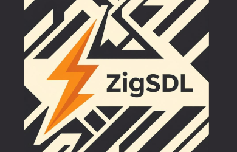

[-orange?logo=Zig&logoColor=Orange&label=Zig&labelColor=Orange)](https://ziglang.org/download/)
[](https://github.com/mmoehabb/zigsdl/releases/tag/0.1.0)
[](https://github.com/mmoehabb/zigsdl/blob/main/LICENSE)

## About

A relatively easy-to-pick, simple, and straightforward package that developers can use in order to write graphic applications in [Zig](https://ziglang.org/). Just as the name indicates it's build on [SDL3](https://www.libsdl.org/).

- [Install SDL3](#install-sdl3)
- [Install ZigSDL](#install-zigsdl)
- [Run an Example](#run-an-example)
- [Extend the Functionality](#extend-the-functionality)
- [TODOs](#todos)

## Install ZigSDL

You can use ZigSDL in your zig project by fetching it as follows:

```bash
zig fetch --save git+https://github.com/mmoehabb/zigsdl.git
```

And then add it as an import in your exe root module:

```zig
const exe = b.addExecutable(.{
    .name = "your-project",
    .root_module = exe_mod,
});

const zigsdl_dep = b.dependency("zigsdl", .{
    .target = target,
    .optimize = optimize,
});

const zigsdl_mod = zigsdl_dep.module("zigsdl");

exe.root_module.addImport("zigsdl", zigsdl_mod);
```

> Make sure to install SDL3 first.

## Run an Example

First ensure to install SDL3 on your machine, and Zig of course. Choose any example file in the examples directory, and then run it with the following command:

> Note: compatible only with zig versions ^0.15.0

  ```bash
  zig build example:<example-filename>
  ```

For instance:

  ```bash
  zig build example:moving-box
  ```

## Extend the Functionality

I bet if you gave the code a look, you'd already know how to extend it and make a functional game with ZigSDL. Here's the moving-box zig file:

```zig
const zigsdl = @import("zigsdl");
const std = @import("std");

pub fn main() !void {
    var gpa = std.heap.GeneralPurposeAllocator(.{}){};
    const allocator = gpa.allocator();
    defer {
        const deinit_status = gpa.deinit();
        if (deinit_status == .leak) std.debug.panic("Memory leak detected!", .{});
    }

    // Create a drawable object
    var rect = zigsdl.drawables.Rect.new(
        .{ .w = 20, .h = 20, .d = 1 },
        .{ .g = 255 },
    );
    var rect_drawable = rect.toDrawable();

    var obj = zigsdl.modules.Object.init(allocator, .{
        .name = "GreenBox",
        .position = .{ .x = 20, .y = 20, .z = 1 },
        .rotation = .{ .x = 0, .y = 0, .z = 0 },
        .drawable = &rect_drawable,
    });
    defer obj.deinit();

    // Add movement script to the object
    var movement = zigsdl.scripts.Movement{ .velocity = 5, .smooth = true };
    try obj.addScript(@constCast(&movement.toScript()));

    // Create a scene and add the obj into it
    var scene = zigsdl.modules.Scene.init(allocator);
    defer scene.deinit();
    try scene.addObject(&obj);

    // Create a screen, attach the scene to it, and open it
    var screen = zigsdl.modules.Screen.init(allocator, .{
        .title = "Simple Game",
        .width = 320,
        .height = 320,
        .rate = 1000 / 60,
    });
    defer screen.deinit();
    screen.setScene(&scene);
    try screen.open();
}
```

You may add as many objects as you want in the scene, you can easily add different functionalities and behaviour to your objects by adding scripts into them; you may use ZigSDL pre-defined drawables and/or scripts or write your own ones as follows:

The Rect Drawable:

```zig
const zigsdl = @import("zigsdl");

pub const Rect = struct {
    dim: zigsdl.types.common.Dimensions,
    color: zigsdl.types.common.Color = .{},
    _draw_strategy: zigsdl.modules.DrawStrategy = zigsdl.modules.DrawStrategy{
        .draw = draw,
        .destroy = destroy,
    },

    pub fn new(dim: zigsdl.types.common.Dimensions, color: zigsdl.types.common.Color) Rect {
        return Rect{
            .dim = dim,
            .color = color,
        };
    }

    pub fn toDrawable(self: *Rect) zigsdl.modules.Drawable {
        return zigsdl.modules.Drawable{
            .dim = self.dim,
            .color = self.color,
            .drawStrategy = &self._draw_strategy,
        };
    }

    fn draw(
        _: *zigsdl.modules.Drawable,
        _: *const zigsdl.modules.DrawStrategy,
        renderer: *zigsdl.sdl.SDL_Renderer,
        p: zigsdl.types.common.Position,
        _: zigsdl.types.common.Rotation,
        dim: zigsdl.types.common.Dimensions,
    ) !void {
        if (!sdl.c.SDL_RenderFillRect(renderer, &sdl.c.SDL_FRect{
            .x = p.x,
            .y = p.y,
            .w = dim.w,
            .h = dim.h,
        })) return error.RenderFailed;
    }

    fn destroy(
        _: *zigsdl.modules.Drawable,
        _: *const zigsdl.modules.DrawStrategy,
    ) void {}
};
```

The Movement script:

```ZIG
const zigsdl = @import("zigsdl");

pub const Movement = struct {
    velocity: f32 = 5,
    smooth: bool = true,

    _script_strategy: zigsdl.modules.ScriptStrategy = zigsdl.modules.ScriptStrategy{
        .start = start,
        .update = update,
        .end = end,
    },

    _last_pressed: zigsdl.types.event.Key = .Unknown,

    pub fn toScript(self: *Movement) zigsdl.modules.Script {
        return modules.Script{ .strategy = &self._script_strategy };
    }

    fn start(_: *zigsdl.modules.Script, _: *zigsdl.modules.Object) void {}

    fn update(s: *zigsdl.modules.Script, o: *zigsdl.modules.Object) void {
        const obj = o;
        const self = @as(*Movement, @constCast(@fieldParentPtr("_script_strategy", s.strategy)));
        var em = o.*._scene.?.screen.?.em;

        if (self.smooth) {
            if (em.isKeyDown(.W)) obj.position.y -= self.velocity;
            if (em.isKeyDown(.S)) obj.position.y += self.velocity;
            if (em.isKeyDown(.D)) obj.position.x += self.velocity;
            if (em.isKeyDown(.A)) obj.position.x -= self.velocity;
            return;
        }

      // ...
    }

    fn end(_: *zigsdl.modules.Script, _: *zigsdl.modules.Object) void {}
};
```

Moreover, you may access SDL indirectly from ZigSDL, and use SDL facilities in your scripts:

```zig
const sdl = @import("zigsdl").sdl;
sdl.SDL_RenderFillRect(...);
```

## Install SDL3

This guide provides brief instructions for installing SDL3 on various operating systems to support projects like `zigsdl`.

> Generated by Grok

### Windows

- **Using vcpkg**:

  ```bash
  vcpkg install sdl3
  vcpkg install sdl3_ttf
  vcpkg install sdl3_image
  ```

- **Manual Installation**:

  - Download the SDL3 development libraries from [libsdl.org](https://www.libsdl.org).
  - Extract the archive and add the `include` and `lib` directories to your compiler's include and library paths.
  - Ensure `SDL3.dll` is in your executable's directory or system PATH.

### macOS

- **Using Homebrew**:

  ```bash
  brew install sdl3
  brew install sdl3_ttf
  brew install sdl3_image
  ```

- **Manual Installation**:

  - Download the SDL3 DMG from [libsdl.org](https://www.libsdl.org).
  - Copy `SDL3.framework` to `/Library/Frameworks` or your project directory.
  - Link against the framework in your build configuration.

### Linux (Ubuntu/Debian)

- **Using apt**:

  ```bash
  sudo apt-get update
  sudo apt-get install libsdl3-dev
  sudo apt-get install libsdl3_ttf-dev
  sudo apt-get install libsdl3_image-dev
  ```

- **Manual Installation**:

  1. Install SDL3
    ```bash
    wget https://github.com/libsdl-org/SDL/releases/download/release-3.2.26/SDL3-3.2.26.tar.gz
    tar -xf SDL3-3.2.26.tar.gz
    mkdir ./SDL3-3.2.26/build
    cd ./SDL3-3.2.26/build
    cmake ..
    cmake --build . --parallel $(nproc)
    sudo cmake --install .
  ```

  2. Install SDL3_ttf
    ```bash
    wget https://github.com/libsdl-org/SDL_ttf/releases/download/release-3.2.2/SDL3_ttf-3.2.2.tar.gz
    tar -xf SDL3_ttf-3.2.2.tar.gz
    mkdir ./SDL3_ttf-3.2.2/build
    cd ./SDL3_ttf-3.2.2/build
    cmake ..
    cmake --build . --parallel $(nproc)
    sudo cmake --install .
  ```

  3. Install SDL3_image
    ```bash
    wget https://github.com/libsdl-org/SDL_image/releases/download/release-3.2.4/SDL3_image-3.2.4.tar.gz
    tar -xf SDL3_image-3.2.4.tar.gz
    mkdir ./SDL3_image-3.2.4/build
    cd ./SDL3_image-3.2.4/build
    cmake ..
    cmake --build . --parallel $(nproc)
    sudo cmake --install .
  ```

### Linux (Fedora)

- **Using dnf**:

  ```bash
  sudo dnf install SDL3-devel
  sudo dnf install SDL3_ttf-devel
  sudo dnf install SDL3_image-devel
  ```

### Linux (Arch)

- **Using paru**:

  ```bash
  paru -S sdl3
  paru -S sdl3_ttf
  paru -S sdl3_image
  ```

### Verifying Installation

- Run `pkg-config --libs --cflags sdl3` to check if SDL3 is correctly installed and accessible.
- Ensure your build system (e.g., Zig) can find SDL3 by linking with `-lSDL3`.

For detailed instructions or troubleshooting, visit the [SDL3 documentation](https://wiki.libsdl.org/SDL3/Installation).


## TODOs

### Version 0.2.0

#### Features
- [ ] Make scenes behave like cameras; they can zoom in and out, and even move in the four directions.
- ...

#### Drawables
- [ ] Implement a drawable for each common geometric shape.
- [ ] Implement _Button_ drawable.
- ...

#### Scripts
- [ ] Implement _Rigidbody_ script; it should, at minimum, specify the mass of the object, detect collisions, and apply gravity.
- [ ] Implement _Collision_ script; any two objects with this script, and one of them is a rigid-body, they shall not overlap.
- ...

#### Examples
- [ ] Develop a [Pong game](https://www.ponggame.org/).
- ...
